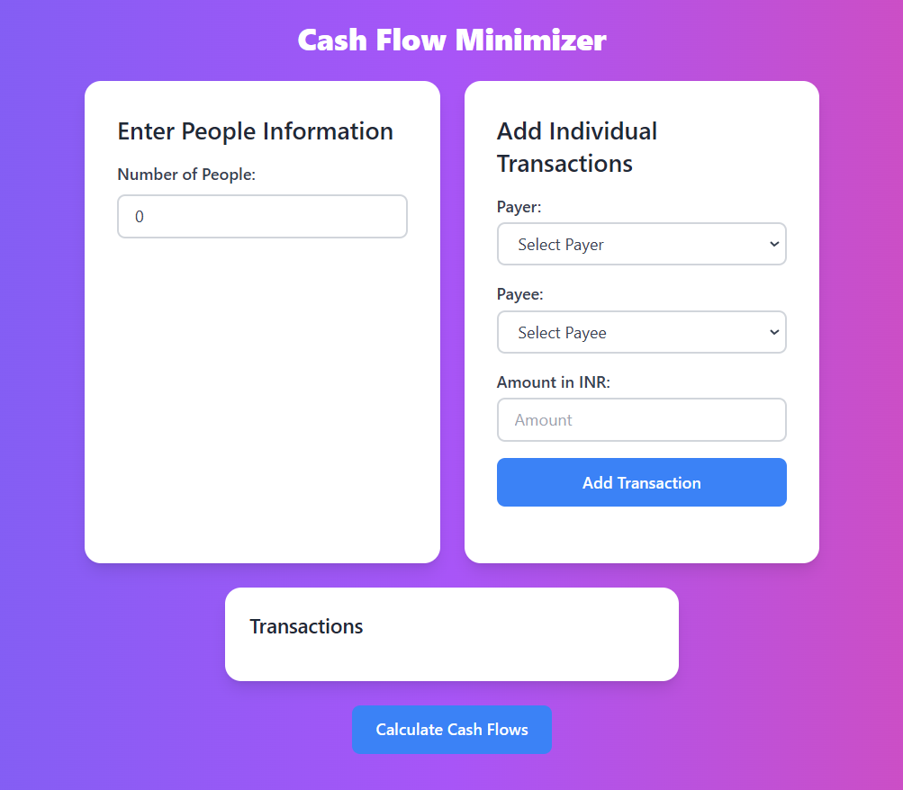
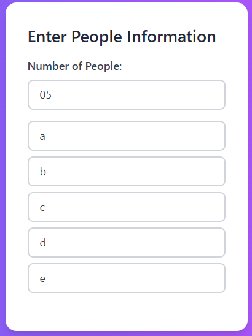
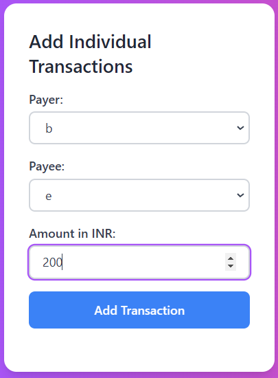
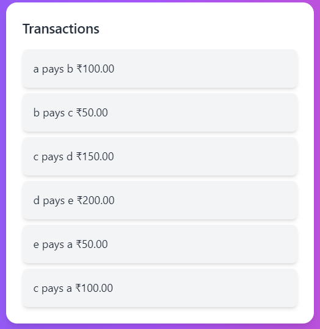
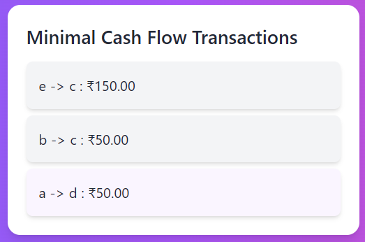

# Cash Flow Minimizer

This project is a **Cash Flow Minimizer** built with **React.js** and styled with **Tailwind CSS**. It helps reduce the number of transactions between multiple people, making it easier to settle shared expenses and debts efficiently.

## Live Demo
[View the deployed site on Netlify](https://flowminimizer.netlify.app/)

## Features
- **Transaction Reduction**: Minimizes the number of transactions required to settle debts between a group of people.
- **Easy Input**: Users can input debts or payments between individuals, and the app calculates the optimal way to balance everyone's transactions.
- **Responsive Design**: Fully responsive interface styled with Tailwind CSS for a seamless experience on all devices.

## Installation and Setup
To run this project locally, follow these steps:

1. **Clone the repository**:
   ```bash
   git clone https://github.com/divysuthar/Cash-flow-minimizer.git
2. **Navigate to the project folder**:
   ```bash
   cd Cash-flow-minimizer
3. Install dependencies:
   ```bash
   npm install
4. Start the development server:
   ```bash
   npm run dev

## Technologies Used
- **React.js**: For building the user interface and managing application state.
- **Tailwind CSS**: For rapid and responsive styling.
- **Netlify**: For deployment and hosting.

## Screenshots
  ### Dashboard


### People information


### Add transaction


### Transaction


### Minimized transaction



  
